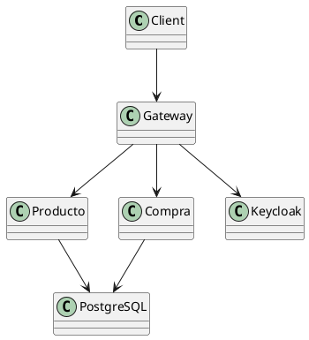

# Imágenes de Arquitectura

Este directorio contiene los diagramas visuales del sistema.

## Cómo generar los diagramas

### Opción 1: Usar draw.io / diagrams.net

1. Ir a https://app.diagrams.net/
2. Crear nuevo diagrama
3. Usar el diagrama de texto de `ARCHITECTURE.md` como referencia
4. Exportar como PNG: `architecture.png`

### Opción 2: Usar PlantUML

### Opción 3: Usar Mermaid (GitHub soporta Mermaid)

Ver `ARCHITECTURE.md` para diagramas en formato texto.

## Diagramas pendientes

- [ ] `architecture.png` - Diagrama completo del sistema
- [ ] `auth-flow.png` - Flujo de autenticación OAuth2
- [ ] `database-schema.png` - Esquema de base de datos
- [ ] `deployment.png` - Diagrama de despliegue en Docker

## Herramientas recomendadas

- **Draw.io Desktop**: https://github.com/jgraph/drawio-desktop
- **PlantUML**: https://plantuml.com/
- **Mermaid Live Editor**: https://mermaid.live/
- **Excalidraw**: https://excalidraw.com/
